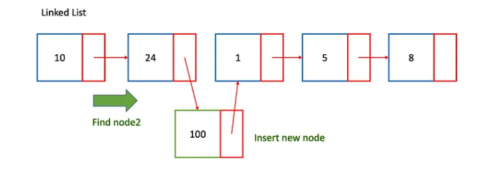

## LinkedList 鏈結

- 每一個 node 儲存的資料可以是不同的資料型別
- 每一個 node 放在不同記憶體位置，不會按線性的順序儲存資料
- 記憶體非連續，不需事先知道整體資料大小
- 每一個 node 會儲存下一個 node 的記憶點位置的 Pointer
- 只能拿到這條鏈最前面的 node
- 可以有單向或雙向的 linked list

## methods

#### Insert

當我們要插入 list 的第三個位置，只需要將原本指向第三個 node 的那一個 node 的指向換掉就好，也就是說把 node.next 替換成新的節點就好，再把新的點的 next 接去原本舊的第三個節點就好。

