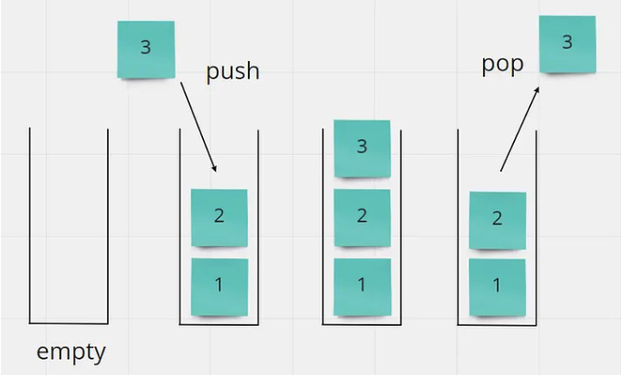

### Stack 堆疊

先進後出，後進先出 LIFO

堆疊是一種線性資料結構，遵循 LIFO (Last In, First Out) 原則。就像一疊盤子，最後放上去的盤子會最先被取走。

**主要操作：**

- `push()`: 將元素加入堆疊頂部
- `pop()`: 移除並返回堆疊頂部的元素
- `peek()`: 查看堆疊頂部的元素但不移除
- `isEmpty()`: 檢查堆疊是否為空
